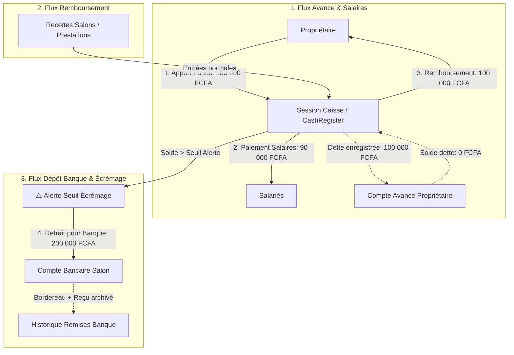

# Gestion des Avances Propriétaire & Dépôts Bancaires d'Écrémage

Ce document décrit l'architecture et le plan de développement pour résoudre les deux problématiques de trésorerie du salon :
1. **L'avance de trésorerie par le propriétaire** (quand la caisse est insuffisante pour payer les charges/salaires) et son **remboursement ultérieur traçable** sans impacter le chiffre d'affaires.
2. **Le dépôt d'espèces en banque (Écrémage régulier)** avec suivi des bordereaux et **alerte automatique configurable de seuil maximal en caisse**.

---

## 1. Analyse Métier & Problématique

---

## Proposed Changes

### Base de Données & Modèles Eloquent

#### [NEW] Migration `create_owner_advances_table.php` & Modèle [OwnerAdvance.php](file:///c:/Users/D3vOs/Projets/Laravel/Web/barbershop/app/Models/OwnerAdvance.php)
- **Table `owner_advances`** :
  - `id` (PK)
  - `cashRegisterId` (FK nullable -> `cash_registers`) : Session de caisse concernée si apport physique
  - `userId` (FK -> `users`) : Propriétaire ayant fait l'avance
  - `amount` (decimal:0) : Montant initial apporté
  - `refundedAmount` (decimal:0, default: 0) : Montant remboursé à date
  - `status` (`pending`, `partially_refunded`, `refunded`)
  - `reason` (string, ex: "Paiement des salaires du mois", "Achat d'urgence", "Fond de roulement")
  - `notes` (text nullable)
  - `createdBy` (FK nullable -> `users`)
  - `timestamps`

#### [NEW] Migration `create_owner_refunds_table.php` & Modèle [OwnerRefund.php](file:///c:/Users/D3vOs/Projets/Laravel/Web/barbershop/app/Models/OwnerRefund.php)
- **Table `owner_refunds`** :
  - `id` (PK)
  - `ownerAdvanceId` (FK -> `owner_advances`)
  - `cashRegisterId` (FK nullable -> `cash_registers`) : Session de caisse débitée pour le remboursement
  - `amount` (decimal:0) : Montant remboursé
  - `paymentMethod` (string: `cash`, `transfer`, etc.)
  - `notes` (text nullable)
  - `createdBy` (FK nullable -> `users`)
  - `timestamps`

#### [NEW] Migration `create_bank_deposits_table.php` & Modèle [BankDeposit.php](file:///c:/Users/D3vOs/Projets/Laravel/Web/barbershop/app/Models/BankDeposit.php)
- **Table `bank_deposits`** :
  - `id` (PK)
  - `reference` (string unique, ex: `DEP-202608-0001`)
  - `cashRegisterId` (FK -> `cash_registers`) : Session de caisse d'où proviennent les espèces
  - `amount` (decimal:0) : Montant retiré et déposé en banque
  - `bankName` (string, ex: "Ecobank", "BOA", "Orabank", etc.)
  - `bankAccountNumber` (string nullable)
  - `depositSlipNumber` (string nullable, n° de reçu/bordereau bancaire)
  - `depositSlipPhoto` (string nullable, scan ou photo du bordereau de dépôt)
  - `depositedBy` (FK nullable -> `users`) : Responsable ayant fait la remise
  - `status` (`pending`, `confirmed`, `cancelled`)
  - `depositDate` (datetime)
  - `notes` (text nullable)
  - `createdBy` (FK nullable -> `users`)
  - `timestamps`

---

### Caisse & Logique de Trésorerie

#### [MODIFY] [CashRegister.php](file:///c:/Users/D3vOs/Projets/Laravel/Web/barbershop/app/Models/CashRegister.php)
- Ajouter les relations :
  - `ownerAdvances()`, `ownerRefunds()`, `bankDeposits()`
- Centraliser le calcul précis du solde théorique de caisse :
  - Formule : `openingAmount + (Ventes Cash) + (Apports Divers Cash) + (Avances Propriétaire Cash) - (Dépenses Cash) - (Remboursements Propriétaire Cash) - (Dépôts en Banque) +/- Ajustements`.
- Ajouter la méthode d'évaluation de seuil d'écrémage :
  - `isBankDepositThresholdReached(): bool`
  - `getBankDepositThreshold(): float` (lu depuis Setting `cash_bank_deposit_threshold`, défaut 150 000 FCFA).

#### [MODIFY] [CashTransaction.php](file:///c:/Users/D3vOs/Projets/Laravel/Web/barbershop/app/Models/CashTransaction.php)
- Enrichir le typage et l'étiquetage des transactions :
  - `owner_contribution` (Entrée : Avance Propriétaire)
  - `owner_refund` (Sortie : Remboursement Propriétaire)
  - `bank_deposit` (Sortie : Dépôt en banque / Écrémage)

---

### Interface Filament & Expérience Utilisateur

#### [MODIFY] [ViewCashRegister.php](file:///c:/Users/D3vOs/Projets/Laravel/Web/barbershop/app/Filament/Resources/CashRegisters/Pages/ViewCashRegister.php)
Ajout d'actions d'en-tête intelligentes avec modales ergonomiques :
1. **Action "Apport Propriétaire" (`heroicon-o-arrow-down-tray`)** :
   - Formulaire modal : Choix de l'apporteur (Propriétaire/Gérant), Montant, Motif / Justification, Notes.
   - Enregistre l'`OwnerAdvance` et la `CashTransaction` (`owner_contribution`).
2. **Action "Rembourser Propriétaire" (`heroicon-o-arrow-up-tray`)** :
   - Visible si une dette existe envers un propriétaire.
   - Affiche le montant restant dû global et par avance.
   - Contrôle de cohérence : vérifie que le montant à rembourser ne dépasse ni la dette ni le solde disponible en caisse.
   - Enregistre l'`OwnerRefund`, met à jour l'avance, et crée la sortie de caisse `owner_refund`.
3. **Action "Dépôt en banque (Écrémage)" (`heroicon-o-building-library`)** :
   - Mise en évidence visuelle (icône pulsante ou badge ambré) si le seuil d'alerte de caisse est dépassé.
   - Formulaire modal : Montant à déposer, Banque réceptrice, N° de bordereau, Photo/Scan du bordereau, Responsable de la remise.
   - Crée l'enregistrement `BankDeposit` et la `CashTransaction` (`bank_deposit`).

#### [MODIFY] [cash-register-history.blade.php](file:///c:/Users/D3vOs/Projets/Laravel/Web/barbershop/resources/views/filament/resources/cash-registers/components/cash-register-history.blade.php)
- Intégrer les nouvelles opérations dans le journal chronologique avec badges élégants :
  - 🟣 **Avance Propriétaire** (`+`)
  - 🟠 **Remboursement Propriétaire** (`-`)
  - 🏦 **Dépôt en Banque** (`-`)

#### [NEW] Resource Filament `BankDepositResource` (Gestion & Suivi des Remises en Banque)
- Consultation de l'historique complet des dépôts bancaires du salon.
- Visualisation des bordereaux scannés/photos.
- Filtrage par banque, date, statut et caisse source.

#### [NEW] Resource Filament `OwnerAdvanceResource` (Suivi de l'Encours & Dette Propriétaire)
- Vue d'ensemble de la dette totale du salon envers le(s) propriétaire(s).
- Tableau récapitulatif : Avance initiale, Montant remboursé, Reste dû, Statut (`En attente`, `Partiellement remboursé`, `Soldé`).
- Historique détaillé des remboursements associés.

#### [MODIFY] [Settings.php](file:///c:/Users/D3vOs/Projets/Laravel/Web/barbershop/app/Filament/Pages/Settings.php) & [settings.blade.php](file:///c:/Users/D3vOs/Projets/Laravel/Web/barbershop/resources/views/filament/pages/settings.blade.php)
- Ajout dans l'onglet **Caisse** des paramètres :
  - Seuil d'alerte pour versement en banque (ex: `150 000 FCFA`).
  - Banque et compte bancaire par défaut du salon.

---

## Verification Plan

### Tests Automatisés (Pest)
- [NEW] `tests/Feature/OwnerAdvanceAndRefundTest.php` :
  - Test 1 : Enregistrement d'un apport propriétaire -> vérification du solde de caisse et de l'encours de dette.
  - Test 2 : Paiement des salaires -> vérification de la sortie de caisse.
  - Test 3 : Remboursement partiel puis total du propriétaire -> mise à jour du statut d'avance à `refunded`.
  - Test 4 : Blocage si le remboursement demandé dépasse le solde réel de la caisse.
- [NEW] `tests/Feature/BankDepositTest.php` :
  - Test 1 : Création d'un dépôt en banque -> sortie de caisse correspondante et référence bordereau.
  - Test 2 : Déclenchement de l'alerte d'écrémage lorsque le solde dépasse le seuil paramétré.
  - Test 3 : Blocage si le dépôt dépasse le montant en caisse.

### Validation Manuelle & Formatage
- Exécution de `vendor/bin/pint --format agent` sur tous les fichiers modifiés.
- Exécution de `php artisan test --compact` pour garantir 100% de tests au vert.
