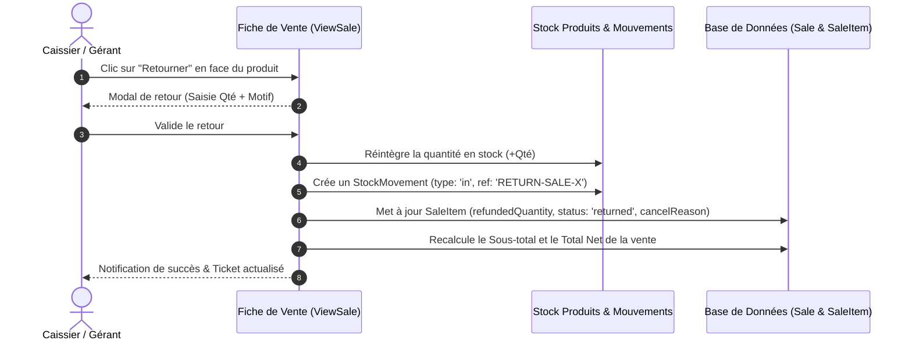
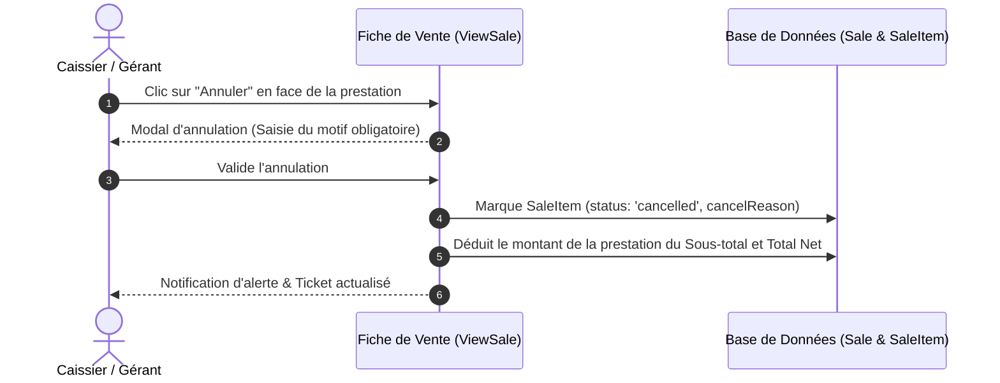

# 📖 Documentation Fonctionnelle : Retours Produits, Annulation Prestations & Édition des Ventes

Ce document détaille le fonctionnement, les règles métier et les impacts techniques des nouveaux flux de **gestion des retours**, d'**annulation de prestations** et de **modification des ventes** implémentés sur la branche `feature/sales-returns-and-edition`.

---

## 1. 📦 Retour d'un Produit (Partiel ou Total)

### Scénario :
Un client a acheté un ou plusieurs produits (ex : 2 pots de cire) et souhaite en retourner 1 ou la totalité (changement d'avis, défaut, etc.).

### Règles & Impacts :
1. **Quantité retournée** : Le gérant peut choisir de retourner tout ou partie de la quantité vendue (ex. 1 sur 3).
2. **Réintégration automatique en stock** :
   - Le stock du produit est immédiatement réincrémenté (`$product->increment('stockQuantity', $qty)`).
   - Un mouvement de stock d'entrée (`StockMovement` de type `in`) est consigné avec le motif et la référence `"RETURN-SALE-{$sale->id}"`.
3. **Mise à jour financière** :
   - La ligne du ticket barre le montant retourné.
   - Le Sous-total et le Total Net de la vente sont automatiquement diminués de la valeur des articles retournés.
4. **Statut de l'article** :
   - Si la totalité de la quantité est retournée, le statut de la ligne passe à `📦 Retourné`.
   - Si tous les articles d'une facture sont retournés ou annulés, le statut global de la vente passe à `Annulée`.

---

## 2. ✂️ Annulation / Remboursement d'une Prestation

### Scénario :
Une prestation de coiffure ou de soin a été encaissée, mais fait l'objet d'une contestation, d'une erreur de saisie ou d'un geste commercial (insatisfaction client, prestation non honorée).

### Règles & Impacts :
1. **Saisie du motif obligatoire** : Enregistrement de la justification (*Insatisfaction client, geste commercial, erreur de caisse, prestation non réalisée*).
2. **Pas de mouvement de stock** : Une prestation étant immatérielle, aucun stock n'est impacté.
3. **Impact Chiffre d'Affaires & Coiffeur** :
   - Le montant de la prestation est déduit de la facture.
   - La prestation annulée n'est plus prise en compte dans le calcul du chiffre d'affaires et des performances du coiffeur.
4. **Affichage sur le ticket** : La prestation apparaît barrée avec le badge `❌ Annulée` et la mention du motif.

---

## 3. 🛠️ Édition Complète d'une Vente (`SaleForm` & `EditSale`)

### Scénario :
Le gérant souhaite modifier l'intégralité d'une vente (ajouter une prestation oubliée, changer de coiffeur, modifier les quantités, appliquer une remise ou retirer un produit).

### Fonctionnalités :
1. **Gestionnaire d'Articles Dynamique (`Repeater`)** :
   - Ajout illimité de prestations (`✂️ Prestation`) et de produits (`🧴 Produit`).
   - Sélection assistée avec auto-complétion du nom, du prix unitaire et affichage du stock disponible en temps réel.
2. **Calculs Réactifs en Direct** :
   - Le Sous-total brut, la remise globale et le Total Net sont recalculés automatiquement dès modification d'une quantité, d'un prix unitaire ou d'une remise ligne.
3. **Synchronisation Automatique et Intelligente des Stocks (`EditSale`)** :
   - Si la quantité d'un produit est augmentée : diminution du stock (`StockMovement` de type `out`).
   - Si la quantité d'un produit est diminuée, supprimée ou marquée `returned` : réintégration en stock (`StockMovement` de type `in`).

---

## 4. 🧪 Tests & Validation Automatisée

Une suite de tests Pest dédiée ([`SaleReturnAndEditTest.php`](file:///c:/Users/D3vOs/Projets/Laravel/Web/barbershop/tests/Feature/SaleReturnAndEditTest.php)) couvre :
- ✅ Le retour partiel de produit avec contrôle d'incrémentation de stock et traçabilité `StockMovement`.
- ✅ L'annulation d'une prestation avec recalcul financier immédiat.
- ✅ L'accès au formulaire complet d'édition avec le Repeater d'articles.
- ✅ **68/68 tests Pest de l'application validés avec succès** (312 assertions).
